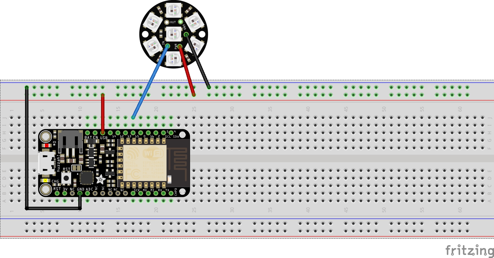

# Jar-of-Light
My neighbor asked me if I was going to put up any Xmas lights. Anyone can put up ordinary lights, but 
I wanted Santa tracking, naughty/nice detection, and other Xmas awesomeness. This project takes your 
average led lights, mixes in a microcontroller, adds some animation, and puts it all under wireless 
network control.  Package all this up in a mason jar and you have... the Jar-of-Light!

## Getting Started

You will need to prototype the circuit first.  While you can get some of these parts through cheaper sources such as ebay,
I like to buy mine from Adafruit to support all of the work they've done.  I really like the Arduino compatible
Adafruit Feather line.  I used a Feather Huzzah for this project, along with a Neopixel Jewel I had in my 
parts box. You will want a wide-mouth mason jar and some small clear marbles to diffuse the light. For the 
lamp holder I used black pipe fittings that you can find at your favorite hardware/building supply store.

PARTS:

    Adafruit Feather Huzzah ESP8266
    https://www.adafruit.com/product/2821

    Adafruit  NeoPixel Jewels now have 4 LEDs 
	in them (red, green, blue, and white) 
    https://www.adafruit.com/product/2860

    Wide mouth mason jar, flat clear marbles (vase filler)

### Breadboard/Prototype Circuit

### Prerequisites

You will need the Arduino - make sure to install the proper board
support using the Arduino IDE Board Manager option
https://www.arduino.cc/en/Main/Software

Install the following libraries into your Arduino/Libraries folder

Adafruit Neopixel Library
https://github.com/adafruit/Adafruit_NeoPixel

ESP8266 Core Library for Arduino
https://github.com/esp8266/Arduino

Optional - I used Visual Studio 2017 with the Visual Micro add-on.  It is much easier
to browse types, see declarations/definitions, etc. than it is in the Arduino IDE.

## Building/Installing

1.  Open the jar_of_light.ino file in the Arduino IDE.
1.  Find the WLAN_SSID and WLAN_PASS variables and set them with your wireless settings
1.  Select the proper board you are using by selecting Tools->Boards->Board Manager from within the IDE
1.  Verify the software builds successfully
1.  Upload to the device

## Using

You interact with Jar-of-Light via REST-like API endpoints. This allows you to integrate 
the Jar-of-Light with a wide variety of tools, such as curl in a script, node-red, or even a browser.

The device supports multicast DNS (mDNS).  If you have a compatible browser and/or OS, you should
be able to access the device's REST endpoints using the FQDN .local (i.e. jar-of-light.local to
the hostname.)

LEDs  
The BLUE LED indicates a good network connection.  It turns on when the Jar-of-Light successfully
associates with your wireless LAN.

The RED LED indicates activity. It will flash to indicate the device is operating normally.

## Examples

Turn off all the leds
http://jar-of-light.local/led/command/off

Turn on all of the leds
http://jar-of-light.local/led/command/on

Transitions thru various colors on the color wheel
http://jar-of-light.local/led/command/wheel

Animates the leds by pulsing from dim to brighter, then
from brighter to dimmer
http://jar-of-light.local/led/command/pulse

Strobes the leds by quickly turning them off to on
http://jar-of-light.local/led/command/strobe

Randomly turns one (1) led on, which causes
a flickering effect
http://jar-of-light.local/led/command/flicker

Demo mode will cycle thru all of the various animations
http://jar-of-light.local/led/command/demo

Over-The-Air Firmware Support  
The Jar-of-Light supports OTA firmware updates. This is currently *not* password 
protected and is a convenience feature to make it easier to hack new animations 
into your Jar-of-Light.

## Security

Ideally, all network communication would be TLS/SSL encrypted, the configuration stored on 
the SPIFF file system would be encrypted, etc. However, the current ESP8266 core library 
does not have TLS/SSL support for the web server,and I did not find any ESP8266 hardware 
features to act as a TPM/keystore.  

The Jar-of-Light is for entertainment. Therefore, I purposely chose to relax the 
security of this implementation.  The REST-like endpoints do not need any authentication 
and the OTA firmware updates do not require a password. If you take this design and use it 
for something other than entertainment (such as a walkway light where someone could get 
hurt if the light suddenly turns off) then please tighten the security accordingly.

## Authors

* **Sean Foley** - *Initial work*

## License

You are free to use this code anyway you see fit.

## Acknowledgments
I was going to implement my own color wheel transitioning algorithm, but found the 
Wheel algorithm implemented by Bill Earl.  Thanks for that... it saved me a bunch
of time.
https://learn.adafruit.com/multi-tasking-the-arduino-part-3?view=all

Big thanks for the readme.md template
https://gist.github.com/PurpleBooth/109311bb0361f32d87a2